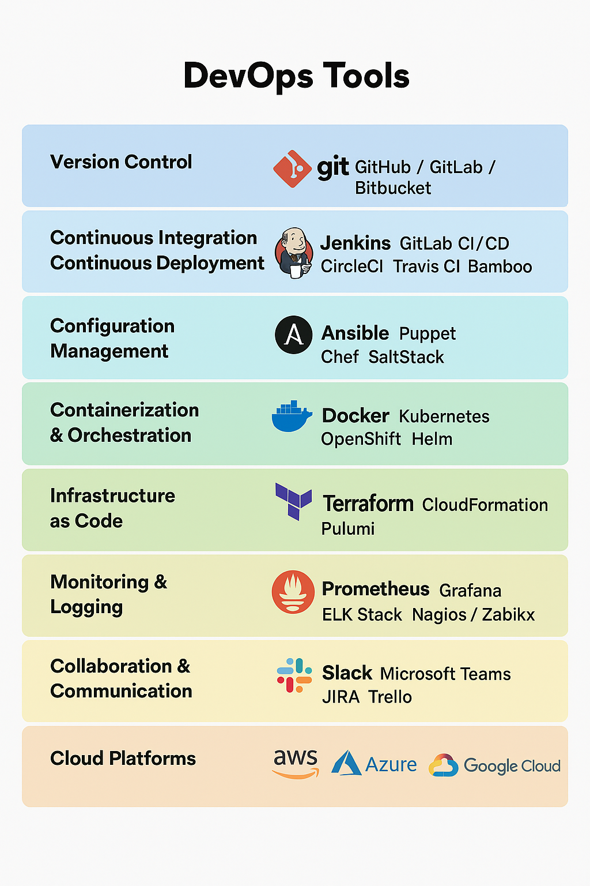
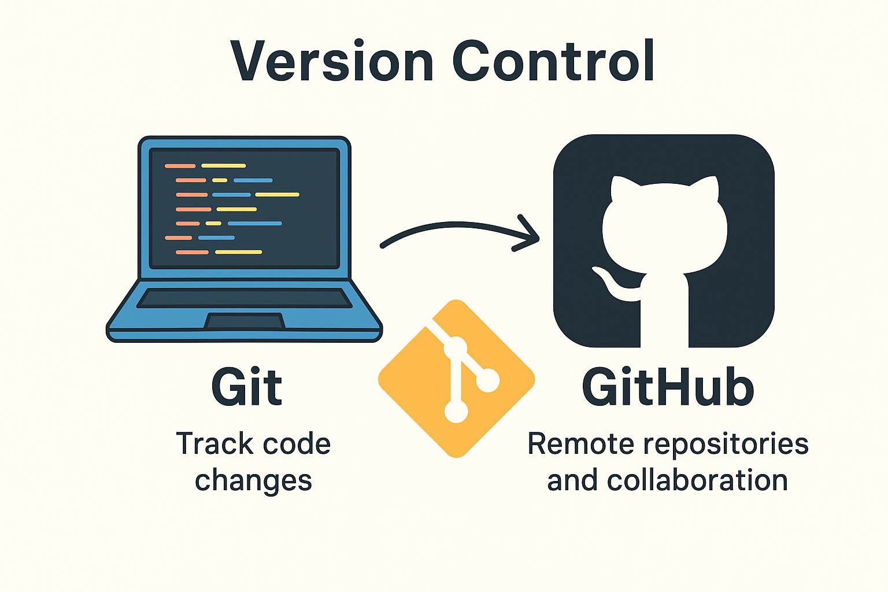

DevOps Overview
===============

DevOps is a combination of practices, tools, and cultural philosophies that aim to bridge the gap between software development (Dev) and IT operations (Ops). Its main goal is to enable organizations to deliver applications and services faster, more reliably, and efficiently.

Core Idea
---------
Traditionally, development teams write code and operations teams deploy and maintain it.
This separation often leads to delays, miscommunication, and errors.
DevOps breaks these silos and promotes collaboration, automation, and continuous feedback.

Key Principles
--------------
1. Collaboration & Communication: Developers, QA, and Ops work together throughout the software lifecycle.
2. Continuous Integration (CI): Code changes are frequently merged into a shared repository and automatically tested.
3. Continuous Delivery/Deployment (CD): After CI, code is automatically deployed to staging or production environments.
4. Automation: Repetitive tasks like testing, deployment, and infrastructure setup are automated.
5. Monitoring & Feedback: Continuous monitoring of applications and infrastructure helps catch issues early.
6. Infrastructure as Code (IaC): Infrastructure is defined and managed through code, making it reproducible and scalable.

Benefits
--------
- Faster development and deployment cycles.
- Reduced errors and downtime.
- Better scalability and reliability.
- Improved collaboration between teams.
- Quick feedback and issue resolution.

Common Tools
------------

1. CI/CD: Jenkins, GitHub Actions, GitLab CI, CircleCI
2. Configuration Management: Ansible, Puppet, Chef
3. Containers & Orchestration: Docker, Kubernetes
4. Cloud & Infrastructure: AWS, Azure, GCP, Terraform
5. Monitoring & Logging: Prometheus, Grafana, ELK Stack

Version Control
---------------

Version control is a system that records changes to your files over time, so you can recall specific versions later. It’s essential in software development because it helps multiple developers work on the same codebase without overwriting each other’s work.

Key Benefits:
- Track changes: Know who changed what and when.
- Revert mistakes: Roll back to a previous working version.
- Collaboration: Multiple people can work on the same project safely.
- Branching: Experiment with new features without affecting the main code.

Git
---
What it is: A distributed version control system.
Purpose: Tracks changes to your code locally and allows you to manage multiple versions.

Core Features:
- git init: Initialize a repository.
- git add: Stage changes.
- git commit: Save changes to history.
- git branch: Work on different features separately.
- git merge: Combine branches.
- git log: View history of commits.

Remote Repositories
-------------------
Remote repositories let you store your code on the cloud and collaborate with others.

Examples:
- GitHub: Popular for open-source projects. Provides pull requests and issue tracking.
- GitLab: Offers built-in CI/CD pipelines. Good for private projects and enterprise use.
- Bitbucket: Integrates well with Atlassian tools like Jira. Supports Git and Mercurial repositories.

Workflow Example
----------------
1. Create a Git repository locally.
2. Make changes and commit them.
3. Push changes to GitHub for team collaboration.
4. Pull updates from teammates to stay in sync.

Class Activity: Launch EC2 & Connect GitHub
------------------------------------------

Step 1: Launch EC2 Instance
1. Login to AWS Console → Search EC2 → Launch instance.
   - AMI: Amazon Linux 2023
   - Instance type: t3.micro (Free Tier)
   - Key pair: Download `.pem` file
   - Security Group: Allow SSH (22) from 0.0.0.0/0
2. Copy the Public DNS.

Step 2: SSH into EC2
```
ssh -i "key.pem" ec2-user@<Public-DNS>
```

Step 3: Install & Configure Git
```
sudo yum update -y
sudo yum install git -y
git --version
```

# Configure Git
```
git config --global user.name "Your Name"
git config --global user.email "your_email@example.com"
git config --list
```

Step 4: Setup GitHub Repository
1. Sign up/login to GitHub
2. Create a new repository (example: myrepo)
3. Add README.md and License (MIT)
4. Example README content:
# My First Repo
This is my practice repository.

Step 5: Clone Repository to EC2
```
git clone https://github.com/<your-username>/myrepo.git
cd myrepo
```

Step 6: Test with Python File
1. Create helloworld.py:
   print("Hello World from EC2 + GitHub!")
2. Run the file:
   python3 helloworld.py

Expected Output:
Hello World from EC2 + GitHub!

End of Activity
---------------
